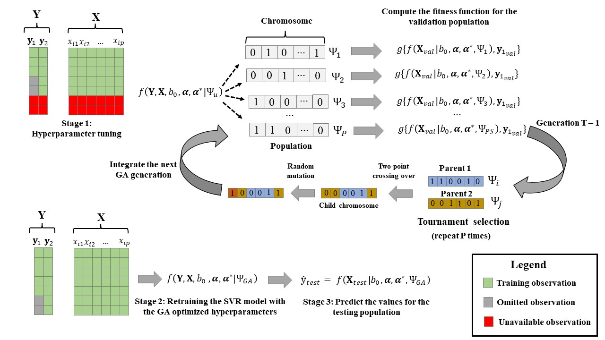

<style>
  body {
    text-align: justify;
    text-justify: inter-word;
    font-family: Helvetica;
    font-size: 14pt;
    }
  img{
  width: 800px;
  height: 400px;
  display: block;
  margin: 0 auto;
}
</style>

```{css, echo=FALSE}
  .columns {display:flex;}
  h1 {color: deepskyblue4;}
  h2 {color: cadetblue;}
```
  
# Introduction 

**qmtsvr** is a R package for fitting (*Quasi*) Multi-task Support Vector Regression methods with a focus on the prediction of complex traits using genomic data. The package expands the commonly used *ɛ -insensitive* loss function for augmenting the number of observations for a target variable (the trait of interest) by aggregating the complementary information of $t – 1$ correlated traits. The high computational burden for the hyperparameter fine-tuning is alleviated by considering trait-common values for the model bias, regularization parameter, and epsilon constant, leading to an optimization problem that can be handled in standard quadratic programming libraries. The *H*-dimensional hyperparameter space (with $H = 2 + t^2$, where *t* is the number of traits) is then optimized via a stochastic evolutionary algorithm. 

# Installation 
The package stable version is not hosted in the [CRAN](https://cran.r-project.org/) yet. However, the development version can be downloaded directly from the github page.

```{r, eval=FALSE}
#Remember to properly install devtools first
library(devtools)
install_github('alvesand/qmtsvr')

```

# Method Description
## QMTSVR formulation
The following data augmentation scheme is employed:  
\begin{equation}
    \arg min_{a,a*}  
    \frac{1}{2}
    \begin{bmatrix}
    \boldsymbol{\alpha^{(1)}} - \boldsymbol{\alpha^{*(1)}}\\
    \boldsymbol{\alpha^{(2)}} - \boldsymbol{\alpha^{*(2)}}\\
    \vdots\\
    \boldsymbol{\alpha^{(t)}} - \boldsymbol{\alpha^{*(t)}}\\
    \end{bmatrix}^{T}
    \boldsymbol{Q}
    \begin{bmatrix}
    \boldsymbol{\alpha^{(1)}} - \boldsymbol{\alpha^{*(1)}}\\
    \boldsymbol{\alpha^{(2)}} - \boldsymbol{\alpha^{*(2)}}\\
    \vdots\\
    \boldsymbol{\alpha^{(t)}} - \boldsymbol{\alpha^{*(t)}}\\
    \end{bmatrix}
    + 
    \epsilon
    \begin{bmatrix}
    \boldsymbol{\alpha^{(1)}} - \boldsymbol{\alpha^{*(1)}}\\
    \boldsymbol{\alpha^{(2)}} - \boldsymbol{\alpha^{*(2)}}\\
    \vdots\\
    \boldsymbol{\alpha^{(t)}} - \boldsymbol{\alpha^{*(t)}}\\
    \end{bmatrix}^{T}
    \boldsymbol{1_{n}} \bigotimes \boldsymbol{1_{t}} - 
    \begin{bmatrix}
    \boldsymbol{\alpha^{(1)}} - \boldsymbol{\alpha^{*(1)}}\\
    \boldsymbol{\alpha^{(2)}} - \boldsymbol{\alpha^{*(2)}}\\
    \vdots\\
    \boldsymbol{\alpha^{(t)}} - \boldsymbol{\alpha^{*(t)}}\\
    \end{bmatrix}^{T}
    \begin{bmatrix}
    \boldsymbol{y^{*(1)}}\\
    \boldsymbol{y^{*(2)}}\\
    \vdots\\
    \boldsymbol{y^{*(t)}}\\
    \end{bmatrix}
        (1)
\end{equation}
\[ s.t 
\begin{cases}
    0 \leq \alpha^{(k)}_{i},\alpha^{*(k)}_{i} \leq C, i = 1,2, ..., N \\
    \begin{bmatrix}
    \boldsymbol{\alpha^{(k)}} - \boldsymbol{\alpha^{*(k)}}\\
    \end{bmatrix}^{T}\boldsymbol{1_{n}} = 0, k = 1,2, ..., t
  \end{cases}
\]

where *t* refers to the number of traits, $\boldsymbol{\alpha^{(k)}}$ and $\boldsymbol{\alpha^{*(k)}}$ are the vectors of positive Lagrange multipliers related to the trait *k*, $\boldsymbol{1_{t}}$ is a *t*-dimensional vector of ones, ⊗ is the Kronecker product, $\boldsymbol{y^{*(1)}}, \boldsymbol{y^{*(2)}}, ..., \boldsymbol{y^{*(t)}}$ are vectors of observed values for *t* target variables standardized to the same scale, and **Q** is a block symmetric matrix, partitioned into $t^{2}$ blocks of dimension *N x N*.
The *Q* matrix in (1) is a multi-task scaled RBF kernel, proposed as follows:  

\begin{equation}
    \boldsymbol{Q} =  
    \begin{bmatrix}
    exp(-\theta_{11}\boldsymbol{D^{2}}p^{-1}) & \cdots & \rho_{1t}exp(-\theta_{1t}\boldsymbol{D^{2}}p^{-1}) \\
    \vdots  & \ddots & \vdots  \\
    \rho_{t1}exp(-\theta_{t1}\boldsymbol{D^{2}}p^{-1}) & \cdots &      exp(-\theta_{tt}\boldsymbol{D^{2}}p^{-1}) \\
    \end{bmatrix}
    (2) 
\end{equation} 
where **D** is an $N \times N$ Euclidean distance matrix (EDM) for the markers’ vectors, considering all genotyped individuals for at least one of the analyzed traits, *p* is some scalar representing the number of predictor variables (*e.g.*, number of SNPs), $\theta_{kk}$ and $\theta_{kk^{'}}$ are trait-specific and trait-common bandwidth hyperparameters, and $\rho_{kk^{'}}$ is some constant between -1 and 1 indicating the magnitude and direction of the association between traits $k$ and $k^{'}$. The **qmtsvr.dist** function can be used for fast computing unweighted and weighted EDMs.    
Using the dual formulation in **eq. (1)**, the function for predicting yet-to-be-seen observations depends solely on the mapping kernel and can be written as $f(\boldsymbol{x_{i}},\boldsymbol{x_{i}}) =  \sum^{(N \times t)}_{j=1}(\alpha^{(k)}_{j}-\alpha^{*(k)}_{j}){Q_{ij}} + b_{0}$, for *k* = 1, 2, ... *t*  (**3**), in which $Q_{ij}$ maps the relationship in the feature space between the individual *i* and every column *j* in the matrix $\boldsymbol{Q}$.   
The predicted value $f(\boldsymbol{x_{i}}$ is then returned to the original scale by using the proper math. Equations 1, 2 and 3 are automatically used with the function **qmtsvr.fit**. Notice that the bias $b_{0}$ value, the regularization hyperparameter ($C$), and the epsilon threshold ($\epsilon$) are assumed to be constant for all traits in equations 1 and 3, consequently, one can fit this extended SVR model with the standard SMO algorithm, available in most kernel-based methods libraries, just by precomputing the block matrix $\boldsymbol{Q}$. Our implementation uses the *kernlab* package (Karatzoglou et al., 2004) as the backend for solving the quadratic programming problem. The model has $2 + t^{2}$ hyperparameters to be tuned, the global $C$ and $\epsilon$  constants, besides the kernel bandwidth hyperparameters ($\theta_{kk^{'}}$) and the association constants ($\rho_{kk^{'}}$) in $\boldsymbol{Q}$. 
  
## QMTSVR fine tuning with Genetic algorithm  
The function **qmtsvr.GA** uses a genetic algorithm (GA) for finding an optimal hyperparameter combination that maximizes the QMTSVR prediction ability. This stochastic evolutionary algorithm compares a population of candidate models (with binary arrays representing different hyperparameter combinations or the chromosome in the GA terminology) according to their fitness scores (*fs*). The arrays for the models with the best *fs* are then selected and crossed for composing the next generation. The resulting child arrays inherit features from both parent chromosomes from the previous generation.   

The relevant parameters in the present GA implementation are the population size (PS), the number of generations (NG), crossover rate (CR), mutation rate (MR), and Tournament Size (*tsize*). The PS indicates the number of models tested per generation; the CR controls the rate that a child's chromosome will result from the crossing-over of two parents instead of being an identical copy of one of them. The MR is the probability of a single bit (or gene) on the binary array changing randomly, implying slight modifications to the current model. The selection operator in the GA was the Tournament Selection, *i.e.*, for each child chromosome to be created, *tsize* individuals are drawn at random from the current population and the one with the highest fs is selected for integrating the pair of crossing chromosomes.  
The GA-based fine-tuning of the QMTSVR hyperparameters is illustrated in Figure 1.
{width=95%}  
**Figure 1. The optimization process of the QMTSVR method via genetic algorithm (GA).** *During the GA-based fine-tuning each specific hyperparameter set is coded as a binary array (the chromosome). The fitness function is computed for each chromosome based on the predictive ability that this specific hyperparameter set achieves in the validation population (omitted during the GA-based optimization). The tournament selection operator selects a pair of individuals with the best fitness scores of two subsets randomly drawn with replacements from the current population. A child chromosome is created for each chromosome pair sampled with the selection operator and P new chromosomes are created for the next generation using the two-point crossing-over and mutation processes. The v worst individuals (set of hyperparameters) of the current generation are replaced with the v best individuals from the previous generation. The GA algorithm repeats the process for T generations. The best hyperparameter set ($Ψ_{GA}$) is then used for retraining the model with all available observations.*         

# Function arguments

The package main functions are:

## qmtsvr.dist 
Returns an $N \times N$ (weighted) Euclidean Distance Matrix (EDM) based on a numeric matrix $X_{N \times p}$. 

the **qmtsvr.dist** function has the following arguments:  

- **`x`** |    A $n \times p$ matrix of genotypes or other features (rows for individuals, columns for predictor variables)  
- **`w`** |    A vector of size $p$ containing the weighting factors to be assigned to the features in $\boldsymbol{X_{N \times p}}$ during the EDM computation (*Optional*).
- **`u`** |  the power of the final EDM values (*default* = `r 2`).
- **`verbose`**     A logical argument indicating if the time elapsed for computing the EDM must be printed (*default* = `r F`).
- **`vardiag`** |    A logical argument specifying if EDM diagonal elements must have variation around zero (*default*=`r F`). If `vardiag`= `r T`, the zero values in EDM diagonals will be replaced with $1-(\frac{d}{\sqrt d * \sqrt m})$ in which $\boldsymbol{d}$ is the diagonal of $\boldsymbol{XX^{T}}$ and *m* is the median of $\boldsymbol{d}$. 

## qmtsvr.fit   
Fits a QMTSVR model with with user pre-defined hyper parameters. Returns an numeric $N \times t$ prediction matrix.   

the **qmtsvr.fit** function has the following arguments:  

- **`Y`** | An $n \times t$ numeric matrix of correlated response variables, where $N$ is the number of observations and $t$ is the number of traits (missing values are coded as `r NA`).
- **`X`** |  A $N \times p$ matrix of features (*e.g.*, SNP markers), in which $p$ is the number of features.
- **`set_hyper`** |  a list specifying the QMTSVR model hyperparameters.
- **`w`** |  A list containing the trait-specific and trait-common weighting factors to be assigned to the features in $\boldsymbol{X_{N \times p}}$ during the EDM computation (*Optional*).  
- **`D`** |  a list with all pre-computed EDM. It can be passed as an argument alternatively to the matrix $\boldsymbol{X_{N \times p}}$ (*Optional*).
- **`verbose`** |  A logical argument indicating if the function log must be printed at the console.
- **`vardiag`** |  A logical argument specifying if diagonal elements of the EMD should have variation around zero. (*default*=`r F`). If `vardiag` = `r T`, the zero values in the EMD diagonal will be replaced with: $1-(\frac{d}{\sqrt d * \sqrt m})$, in which $\boldsymbol{d}$ is the diagonal of $\boldsymbol{XX^{T}}$ and *m* is the median of $\boldsymbol{d}$. This quantity yields a variation around 1 for the diagonal elements of the RBF kernel, computed as $K = e^{-b*D^{2}}$, where $b$ is a hyperparameter constant and $\boldsymbol{D}$ is the Euclidean Distance Matrix. When the SNP matrix is used as input, the diagonal elements in $\boldsymbol{K}$ correlate with those from the $\boldsymbol{G}$ matrix presented in VanRaden (2008).

## qmtsvr.GA    
Optimizes the QMTSVR hyperparameters using a Genetic Algorithm. 

the **qmtsvr.GA** function has the following arguments:  

- **`Y`** | A $N \times t$ matrix of response variables, where N is the number of observations and t is the number of traits (missing values are coded as `r NA`).
- **`X`** | $N \times p$ matrix of features (*e.g.*, SNP markers ), in which $p$ is the number of columns.
- **`hyper`** | A *list* object containing the name specification and range  for each hyperparameter to be optimized in the QMTSVR model.
- **`ngen`** | The number of generations to run in the Genetic Algorithm.
- **`popsize`** The population size (PS) to grow, it indicates the number of models tested per generation.
- **`mut_rate`** | The mutation rate (*e.g.*, 0.05) of the genetic algorithm. It is the probability of a single bit (or gene) on the binary array changing randomly, implying slight modifications to the current model.
- **`cross_rate`** | The crossing over (CR) rate for the genetic algorithm. The CR controls the rate that a child's chromosome will result from the crossing-over of two parents instead of being an identical copy of one of them.
- **`tsize`** | The tournament size to be used in the GA(*default* = 5). For each child chromosome to be created, `tsize` individuals are drawn at random from the current population and the one with the highest fitness scores is selected for integrating the pair of crossing chromosomes.
- **`elitism`** | The number of models with the best performance in the current generation to keep for the next generarion (*default* = 1).
- **`cost`** | The cost function to be optimized in the GA. The values accepted are:  `r "cor"`, `r "rmse"` and `r "mae"` for Pearson correlation between observed and predicted values, *Root-mean squared error* and *Mean absolute error*, respectively. The current version only accepts cost functions for continuous target variables.
- **`w`** | A vector of size $p$ with the weighting factors to be assigned to the features in $\boldsymbol{X}$ for the EDM computation (*Optional*).
- **`tgTrait`** | A constant for indexing the column where the target variable is located at Y (*default* = 1).
- **`val_pop`** | A character object indicating the validation strategy adopted in the GA. `r "cross"` indicates cross-validation, `r "custom"` indicates that the cost for an specific group must be optimized and `r "closest"` indicates that the target population to be optimized will be composed by the closest individuals (based on the Euclidean distance of $\boldsymbol{X}$) to those with `r NA` values in the target variable.
- **`nfolds`** | If val_pop = `r "cross"`, `nfolds` is the number of folds to be used in the cross-validation.
- **`k`** | If `val_pop` = `r "closest"`, `k` is the number closest neighbors to be identified in the EDM for each `r NA` value.
- **`custom_val`** | If `val_pop` = `r "custom"`, `custom_val` is a vector of size *N* assuming 0 (train) and 1 (validation) values for indicating which individual will compose the validation population in the GA.
- **`vartype`** | The target variable class. The current version only accepts `r "continuous"`.
- **`MRCR`** | it can be `r "fixed"` (*default*) or `r "dynamic"`; if the second option is chosen, the GA will gradatively reduce CR and increase MR when the algorithm get stuck in local minima.
- **`verbose`** | A logical argument indicating if the GA output must be printed at the console.
- **`dopar`** A logical argument indicating if the GA will be performed using a parallel process. It will speed up the GA run time. **Attention**: *in the current version it will only work in Linux machines*.
- **`ncores`** | If `dopar` = `r T`, the number of cores to be used must be specified (*default* = *number of cores available* - 1).

# Examples

In this section, we provide some examples on how to use each function of the qmtsvr package.

```{r, include = FALSE}
knitr::opts_chunk$set(
  collapse = TRUE,
  comment = "#>"
)
```

## qmtsvr.dist   

```{r setup}
library(qmtsvr)
# Create toy data
values = rnorm(50, 0, 1)
X = matrix(values, 5, 10)
D = qmtsvr.dist (x=X)
D
#Computing the distance with the R base function
D2 = dist(X,method = "euclidean",diag = T)
D2
# Give more weight for the columns 1 and 5
w = rep(1,10)
w[1] = 5
w[5] = 15.5
D2 = qmtsvr.dist (x=X, w = w)
D2
```

## qmtsvr.fit

```{r}
library(qmtsvr)
#Load dataset
pheno = data_ex$mydata[1:300,5:7]
head(pheno)
X = data_ex$SNP[1:300,] 
obs = pheno #copy the observations matrix
pheno[200:300,1] = NA #omit the last 100 observations
tail(pheno)

#Setting arbitrary hyperparameters values for a single trait SVR model
hyper_st = list("C" = 2, "eps" = 0.009, "b1" = 2.5)

#Predict the values
YHAT = qmtsvr.fit(Y=as.matrix(pheno[,1]), X = X, set_hyper = hyper_st, 
                  verbose = F, vardiag = T)

#Setting arbitrary hyperparameters values for a multi-trait SVR model with 3 traits
hyper_mt = list("C" = 0.2, "eps" = 0.09, "b1" = 0.15, 
                  "b2"= 6.67, "b3" = 2.21,"b4" = 4.26,
                  "b5" = .53, "b6" = 1.4, "r1" = -0.4,
                  "r2" = 0.7, "r3" = 0.14)
#The sequence of bandwidth parameters (b) according to the traits (t1, t2, t3) is:
#     t1 t2 t3
# t1: b1 b2 b3
# t2:  . b4 b5
# t3:  .  . b6

#The sequence of weights r according to the traits (t1, t2, t3) is:
#     t1 t2 t3
# t1:  . r1 r2
# t2:  .  . r3
# t3:  .  .  .

#Predict the values
YHAT2 = qmtsvr.fit(Y=pheno, X = X, set_hyper = hyper_mt, 
                   verbose = T, vardiag = T)

#Correlate the predictions with the observed values
cor(YHAT[200:300,1],obs[200:300,1]) #Single Task
cor(YHAT2[200:300,1],obs[200:300,1]) #Multiple Task
#compute Root-mean squared error
mean(sqrt((YHAT[200:300,1] - obs[200:300,1])^2))#Single Task
mean(sqrt((YHAT2[200:300,1] - obs[200:300,1])^2))#Multiple Task

#plot the results
par(mfrow=c(1,2))
plot(YHAT[200:300,1],obs[200:300,1], pch = 19, 
     lty = 2, xlab = "Predicted values", 
     ylab = "Observed values", 
     col = rgb(0.7,0.5,0.20,0.7), main = "Single Task")

plot(YHAT2[200:300,1],obs[200:300,1], 
     pch = 19, lty = 2, xlab = "Predicted values",
     ylab = "Observed values", col = rgb(0.7,0.5,0.20,0.7), main = "Multiple Task")

```

## qmtsvr.GA
```{r, eval = T}
library(qmtsvr)

pheno = data_ex$mydata[1:300,5:7]
X = data_ex$SNP[1:300,] 
obs = pheno #copy the observations matrix
pheno[200:300,1] = NA #omit the last 100 observations


hyper_st = list(c("C",0.01,5,128), c("eps",0.001,0.2,128), c("b1",0.1,7,128))
#The regularization parameter ("C") will range from 0.01 to 5 (128 values tested)
#The epsilon constant ("eps") will range from 0.001 to 0.2 (128 values tested)
#The bandwidth parameter ("b1") will range from 0.1 to 7 (128 values tested) 

st_svr = qmtsvr.GA(Y = as.matrix(pheno[1:300,1]), 
                   X = X[1:300,], hyper = hyper_st,
                   ngen = 30, popsize = 50, mut_rate = 0.05,
                   cross_rate = 0.95, elitism = 2,
                   cost = "cor", tsize = 5,
                   val_pop = "closest",
                   k = 5,vardiag=T, verbose = F)

#'val_pop' = closest, with k = 5
#This means that the 5 closest neighbors for each NA value 
#will be used as internal validation (based on the Euclidean Distance).
#Since the different NA observations may have the same neighbors, 
#the size of the internal validation population is
#generally smaller than the number of NAs

#Get the list with optimized hyperparameters
st_svr$set_hyper 

#QMT-SVR with 3 response variables
#Define the range for hyperparameters in a multi-task SVR with 3 variables
hyper_mt = list(c("C",0.1,5,128), c("eps",0.001,0.3,128),
                c("b1",0.1,7,128), c("b2",0.1,7,128), c("b3",0.1,7,128),
                c("b4",0.1,7,128), c("b5",0.1,7,128), c("b6",0.1,7,128),
                c("r1",-0.9,0.9,128),c("r2",-0.9,0.9,128),c("r3",-0.9,0.9,128))

#Run the GA for optimizing the model hyperparameters
mt_svr = qmtsvr.GA(Y = pheno, X = X[1:300,],
                   hyper = hyper_mt, ngen = 30,
                   popsize = 50,mut_rate = 0.05, 
                   cross_rate = 0.95, elitism = 2, 
                   cost = "cor", tsize = 5, val_pop = "closest",
                   k=5, vardiag=T, verbose = F)

#Summary of the GA parameters
mt_svr$GA_parameters

#Get the list with optimized hyperparameters
mt_svr$set_hyper

#Plot GA history 
par(mfrow = c(1,2))
plot.GA(st_svr)
plot.GA(mt_svr)

```


# Authors    

## Development & Maintenance
Anderson A.C. Alves (carvalhoalve@wisc.edu)

webpage: http://alvesand.netlify.app/

## Contributors
Guilherme J. M. Rosa (grosa@wisc.edu)

webpage: https://www.gjmrosa.org/

# References


Karatzoglou A., Smola A., Hornik K., and Zeileis A. (2004). kernlab - An S4 Package for Kernel Methods in R. *J. Stat. Soft.* 11:1–20. doi: https://doi.org/10.18637/jss.v011.i09 


VanRaden P. M. (2008). Efficient Methods to Compute Genomic Predictions. *J. Dairy Sci.* 91:4414-4423. doi: https://doi.org/10.3168/jds.2007-0980 
